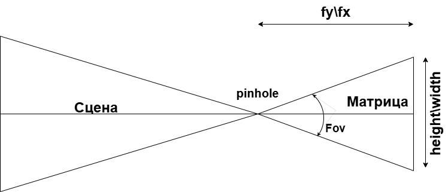

## Постановка задачи

Во многих моих научных проектах камеры используются не только для получения изображений, но и в качестве измерительных инструментов. Для проведения количественных измерений по изображениям необходимо знать параметры камеры и учитывать оптические искажения, возникающие при формировании изображения.

Цель данного проекта -- изучить и практически реализовать методы калибровки камер и стереозрения, применяемые в задачах компьютерного зрения и 3D-реконструкции.

В рамках проекта будут использованы несколько доступных мне камер различных типов: две GoPro, IP-камера Hikvision и камера iPhone. Это позволит сравнить результаты калибровки камер с различной оптикой, разрешением и назначением.

Калибровка будет выполнена с использованием двух типов калибровочных мишеней:

- классического шахматного паттерна (Chessboard);
- комбинированного паттерна ChArUco, содержащего шахматную разметку и ArUco-маркеры.

Для каждой камеры планируется определить внутренние параметры и коэффициенты дисторсии, выполнить коррекцию геометрических искажений изображения и оценить точность полученной калибровки по контрольным данным.

Отдельной частью проекта станет объединение двух камер GoPro в стереопару. Для неё будут определены как внутренние параметры каждой камеры, так и внешние параметры, описывающие взаимное положение камер. После стереокалибровки будет исследована возможность определения глубины и реконструкции трёхмерной структуры сцены.

Ранее в задачах 3D-реконструкции я также работала с RGB-D камерами Intel RealSense и Microsoft Kinect. В данном проекте основной акцент будет сделан на понимании геометрии обычных камер и самостоятельном прохождении полного процесса — от получения калибровочных изображений до оценки точности и построения собственной стереосистемы.

## Понятная теория

Для описания процесса формирования изображения в компьютерном зрении часто используется модель камеры-обскуры (pinhole camera model). В этой модели лучи света от точек наблюдаемой сцены проходят через единую точку — pinhole — и формируют изображение на плоскости матрицы.

Размер области пространства, попадающей в изображение, характеризуется углом поля зрения (Field of View, FOV). Он связан с фокусным расстоянием камеры и физическим размером матрицы: при уменьшении фокусного расстояния поле зрения увеличивается, а при увеличении — уменьшается.

В идеальной pinhole-модели трёхмерная точка сцены $$P = (X, Y, Z)$$ проецируется на плоскость изображения в точку $$p = (u, v)$$.

В однородных координатах это преобразование можно записать как

$$
s
\begin{bmatrix}
u \\ v \\ 1
\end{bmatrix}
=
K
\begin{bmatrix}
R & t
\end{bmatrix}
\begin{bmatrix}
X \\ Y \\ Z \\ 1
\end{bmatrix}
$$

где (K) — матрица внутренних параметров камеры, (R) и (t) описывают её положение относительно мировой системы координат, а (s) является масштабным коэффициентом.

**Внутренние параметры камеры**

Матрица внутренних параметров (camera intrinsic matrix) имеет вид

$$
K =
\begin{bmatrix}
f_x & 0 & c_x\\
0 & f_y & c_y\\
0 & 0 & 1
\end{bmatrix},
$$

где:

(f_x, f_y) — фокусные расстояния, выраженные в пикселях;

(c_x, c_y) — координаты главной точки изображения (principal point).

Эти параметры определяют, каким образом координаты точек в системе камеры преобразуются в пиксельные координаты изображения.

Внутренние параметры относятся к конкретной камере и выбранному режиму съёмки. Поэтому при изменении разрешения изображения, режима работы камеры или параметров оптической системы результаты ранее выполненной калибровки не всегда можно использовать без дополнительного пересчёта или повторной калибровки.

**Дисторсия**

Реальная оптическая система отличается от идеальной pinhole-модели. Линзы вносят геометрические искажения, наиболее заметные по краям изображения.

Одним из основных видов таких искажений является радиальная дисторсия. Особенно хорошо она заметна у широкоугольных камер, например GoPro: прямые линии сцены на изображении могут становиться изогнутыми.

Для описания и компенсации этих искажений при калибровке определяются коэффициенты дисторсии. В стандартной модели OpenCV среди них используются коэффициенты радиальной и тангенциальной дисторсии:

$$
(k_1, k_2, p_1, p_2, k_3).
$$

Таким образом, результатом калибровки камеры являются два основных набора параметров: (K) — матрица внутренних параметров камеры, а (D) — набор коэффициентов дисторсии.

**Внешние параметры**

В отличие от внутренних параметров, внешние параметры (extrinsic parameters) характеризуют не саму оптическую систему, а положение камеры относительно выбранной системы координат.

Они задаются матрицей вращения (R) и вектором переноса (t). Для одной камеры внешние параметры позволяют определить её положение относительно калибровочного паттерна или другой системы координат.

В стереосистеме они приобретают особое значение: необходимо определить взаимное положение двух камер. Именно эти параметры в дальнейшем позволяют находить соответствующие точки и восстанавливать глубину наблюдаемой сцены. (https://docs.opencv.org/3.4.20/dc/dbb/tutorial_py_calibration.html)

# Паттерны для калибровки

Я изучила руководство OpenCV по созданию калибровочных паттернов (https://docs.opencv.org/3.4.8/da/d0d/tutorial_camera_calibration_pattern.html)  и решила сравнить несколько поддерживаемых типов мишеней, чтобы экспериментально определить их достоинства, недостатки и области наиболее эффективного применения:

- Chessboard
- ChArUco
- Symmetric Circles Grid
- Asymmetric Circles Grid

Цель этого этапа — не только получить внутренние параметры камер, но и сравнить различные калибровочные мишени в одинаковых условиях.

**Какие результаты я ожидаю?**

**Chessboard**

В случае классического Chessboard детектируются внутренние углы шахматного паттерна. Это один из наиболее распространённых методов калибровки камеры благодаря простоте изготовления мишени и высокой точности локализации углов.

Однако для надёжного определения паттерна необходимо, чтобы достаточная часть шахматной доски корректно распознавалась на изображении. Это может создавать дополнительные сложности при калибровке стереопары.

Для качественной калибровки желательно получать точки во всех областях изображения, в том числе около его границ, где влияние дисторсии особенно заметно. При работе со стереопарой при этом необходимо одновременно обеспечить хорошую видимость одной и той же мишени обеими камерами. Из-за различающихся полей зрения выполнение этих условий может оказаться сложнее, чем при калибровке одной камеры.

**ChArUco**

ChArUco объединяет шахматный паттерн с ArUco-маркерами, имеющими уникальные идентификаторы.

Благодаря идентификации отдельных маркеров становится возможным определять положение видимой части мишени даже в случаях, когда паттерн частично выходит за границы изображения или перекрывается.

Я предполагаю, что это свойство окажется особенно полезным при работе со стереопарой, поскольку позволит получать калибровочные точки ближе к границам изображения, сохраняя возможность установить соответствие между точками мишени.

В ходе эксперимента предстоит проверить, действительно ли ChArUco окажется удобнее классического Chessboard для калибровки используемой стереосистемы.

**Circles Grid**

С паттернами Symmetric Circles Grid и Asymmetric Circles Grid я ранее не работала, поэтому заранее не буду делать вывод о том, насколько хорошо они подойдут для используемых камер.

В отличие от Chessboard, здесь в качестве характерных точек используются центры окружностей. Я планирую экспериментально сравнить оба варианта Circles Grid с Chessboard и ChArUco и оценить особенности их детектирования и получаемую точность калибровки.

**Изготовление калибровочных мишеней**

Все четыре типа калибровочных паттернов будут сгенерированы программно и протестированы в двух вариантах исполнения: на экране планшета и в напечатанном виде. Это позволит дополнительно исследовать влияние способа изготовления мишени на результаты калибровки.

Использование экрана планшета обеспечивает хорошую плоскостность мишени и исключает деформацию носителя. Однако такой способ имеет собственные потенциальные источники погрешности: пиксельную структуру дисплея, блики и возможное масштабирование изображения программным обеспечением.

Печатная мишень, напротив, не имеет пиксельной структуры дисплея, однако точность её геометрии может зависеть от масштабирования при печати, характеристик принтера и плоскостности закреплённого листа. Поэтому после печати фактические размеры элементов паттерна будут измерены и использованы при калибровке вместо номинальных размеров.

Для каждого из четырёх паттернов — Chessboard, ChArUco, Symmetric Circles Grid и Asymmetric Circles Grid — калибровка будет выполнена как с использованием электронной, так и печатной мишени. При сравнении будут использоваться одинаковые условия съёмки и единый набор метрик оценки точности.
