## Постановка задачи

Во многих моих научных проектах камеры используются не только для получения изображений, но и в качестве измерительных инструментов. Для проведения количественных измерений по изображениям необходимо знать параметры камеры и учитывать оптические искажения, возникающие при формировании изображения.

Цель данного проекта -- изучить и практически реализовать методы калибровки камер и стереозрения, применяемые в задачах компьютерного зрения.

В рамках проекта будут использованы несколько доступных мне камер различных типов: две GoPro, IP-камера Hikvision, Web-камера и камера iPhone. Это позволит сравнить результаты калибровки камер с различной оптикой, разрешением и назначением.

Калибровка будет выполнена с использованием нескольких типов калибровочных мишеней:

- классического шахматного паттерна (Chessboard);
- комбинированного паттерна ChArUco, содержащего шахматную разметку и ArUco-маркеры;
- Circles Grid.

Для каждой камеры планируется определить внутренние параметры и коэффициенты дисторсии, выполнить коррекцию геометрических искажений изображения и оценить точность полученной калибровки по контрольным данным.

Отдельной частью проекта станет объединение двух камер GoPro в стереопару. Для неё будут определены как внутренние параметры каждой камеры, так и внешние параметры, описывающие взаимное положение камер. После стереокалибровки будет исследована возможность определения глубины и реконструкции трёхмерной структуры сцены.

Ранее в задачах 3D-реконструкции я также работала с RGB-D камерами Intel RealSense и Microsoft Kinect. В данном проекте основной акцент будет сделан на понимании геометрии обычных камер и самостоятельном прохождении полного процесса — от получения калибровочных изображений до оценки точности и построения собственной стереосистемы.

## Понятная теория

Для описания процесса формирования изображения в компьютерном зрении часто используется модель камеры-обскуры (pinhole camera model). В этой модели лучи света от точек наблюдаемой сцены проходят через единую точку — pinhole — и формируют изображение на плоскости матрицы.

Размер области пространства, попадающей в изображение, характеризуется углом поля зрения (Field of View, FOV). Он связан с фокусным расстоянием камеры и физическим размером матрицы: при уменьшении фокусного расстояния поле зрения увеличивается, а при увеличении — уменьшается.

В идеальной pinhole-модели трёхмерная точка сцены $$P = (X, Y, Z)$$ проецируется на плоскость изображения в точку $$p = (u, v)$$.

В однородных координатах это преобразование можно записать как

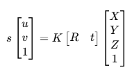

где (K) — матрица внутренних параметров камеры, (R) и (t) описывают её положение относительно мировой системы координат, а (s) является масштабным коэффициентом.

**Внутренние параметры камеры**

Матрица внутренних параметров (camera intrinsic matrix) имеет вид

$$
K =
\begin{bmatrix}
f_x & 0 & c_x\\
0 & f_y & c_y\\
0 & 0 & 1
\end{bmatrix},
$$

где:

(f_x, f_y) — фокусные расстояния, выраженные в пикселях;

(c_x, c_y) — координаты главной точки изображения (principal point).

Эти параметры определяют, каким образом координаты точек в системе камеры преобразуются в пиксельные координаты изображения.

Внутренние параметры относятся к конкретной камере и выбранному режиму съёмки. Поэтому при изменении разрешения изображения, режима работы камеры или параметров оптической системы результаты ранее выполненной калибровки не всегда можно использовать без дополнительного пересчёта или повторной калибровки.

**Дисторсия**

Реальная оптическая система отличается от идеальной pinhole-модели. Линзы вносят геометрические искажения, наиболее заметные по краям изображения.

Одним из основных видов таких искажений является радиальная дисторсия. Особенно хорошо она заметна у широкоугольных камер, например GoPro: прямые линии сцены на изображении могут становиться изогнутыми.

Для описания и компенсации этих искажений при калибровке определяются коэффициенты дисторсии. В стандартной модели OpenCV среди них используются коэффициенты радиальной и тангенциальной дисторсии:

$$
(k_1, k_2, p_1, p_2, k_3).
$$

Таким образом, результатом калибровки камеры являются два основных набора параметров: (K) — матрица внутренних параметров камеры, а (D) — набор коэффициентов дисторсии.

**Внешние параметры**

В отличие от внутренних параметров, внешние параметры (extrinsic parameters) характеризуют не саму оптическую систему, а положение камеры относительно выбранной системы координат.

Они задаются матрицей вращения (R) и вектором переноса (t). Для одной камеры внешние параметры позволяют определить её положение относительно калибровочного паттерна или другой системы координат.

В стереосистеме они приобретают особое значение: необходимо определить взаимное положение двух камер. Именно эти параметры в дальнейшем позволяют находить соответствующие точки и восстанавливать глубину наблюдаемой сцены. (https://docs.opencv.org/3.4.20/dc/dbb/tutorial_py_calibration.html)

# Паттерны для калибровки

Я изучила руководство OpenCV по созданию калибровочных паттернов (https://docs.opencv.org/3.4.8/da/d0d/tutorial_camera_calibration_pattern.html)  и решила сравнить несколько поддерживаемых типов мишеней, чтобы экспериментально определить их достоинства, недостатки и области наиболее эффективного применения:

- Chessboard
- ChArUco
- Symmetric Circles Grid
- Asymmetric Circles Grid

Цель этого этапа — не только получить внутренние параметры камер, но и сравнить различные калибровочные мишени в одинаковых условиях.

**Какие результаты я ожидаю?**

**Chessboard**

В случае классического Chessboard детектируются внутренние углы шахматного паттерна. Это один из наиболее распространённых методов калибровки камеры благодаря простоте изготовления мишени и высокой точности локализации углов.

Однако для надёжного определения паттерна необходимо, чтобы достаточная часть шахматной доски корректно распознавалась на изображении. Это может создавать дополнительные сложности при калибровке стереопары.

Для качественной калибровки желательно получать точки во всех областях изображения, в том числе около его границ, где влияние дисторсии особенно заметно. При работе со стереопарой при этом необходимо одновременно обеспечить хорошую видимость одной и той же мишени обеими камерами. Из-за различающихся полей зрения выполнение этих условий может оказаться сложнее, чем при калибровке одной камеры.

**ChArUco**

ChArUco объединяет шахматный паттерн с ArUco-маркерами, имеющими уникальные идентификаторы.

Благодаря идентификации отдельных маркеров становится возможным определять положение видимой части мишени даже в случаях, когда паттерн частично выходит за границы изображения или перекрывается.

Я предполагаю, что это свойство окажется особенно полезным при работе со стереопарой, поскольку позволит получать калибровочные точки ближе к границам изображения, сохраняя возможность установить соответствие между точками мишени.

В ходе эксперимента предстоит проверить, действительно ли ChArUco окажется удобнее классического Chessboard для калибровки используемой стереосистемы.

**Circles Grid**

С паттернами Symmetric Circles Grid и Asymmetric Circles Grid я ранее не работала, поэтому заранее не буду делать вывод о том, насколько хорошо они подойдут для используемых камер.

В отличие от Chessboard, здесь в качестве характерных точек используются центры окружностей. Я планирую экспериментально сравнить оба варианта Circles Grid с Chessboard и ChArUco и оценить особенности их детектирования и получаемую точность калибровки.

**Изготовление калибровочных мишеней**

Все четыре типа калибровочных паттернов будут сгенерированы программно и протестированы в двух вариантах исполнения: на экране планшета и в напечатанном виде. Это позволит дополнительно исследовать влияние способа изготовления мишени на результаты калибровки.

Использование экрана планшета обеспечивает хорошую плоскостность мишени и исключает деформацию носителя. Однако такой способ имеет собственные потенциальные источники погрешности: пиксельную структуру дисплея, блики и возможное масштабирование изображения программным обеспечением.

Печатная мишень, напротив, не имеет пиксельной структуры дисплея, однако точность её геометрии может зависеть от масштабирования при печати, характеристик принтера и плоскостности закреплённого листа. Поэтому после печати фактические размеры элементов паттерна будут измерены и использованы при калибровке вместо номинальных размеров.

Для каждого из четырёх паттернов — Chessboard, ChArUco, Symmetric Circles Grid и Asymmetric Circles Grid — калибровка будет выполнена как с использованием электронной, так и печатной мишени. При сравнении будут использоваться одинаковые условия съёмки и единый набор метрик оценки точности.

# Калибровка

Как уважающий себя исследователь, первый вопрос, который мне пришёл в голову: сколько кадров вообще нужно для определения внутренних параметров камеры и связано ли это количество с используемым калибровочным паттерном?

В статье Zhengyou Zhang *«A Flexible New Technique for Camera Calibration»*, которая легла в основу широко используемого сегодня подхода к калибровке камеры по плоской мишени, сказано:

> “The technique only requires the camera to observe a planar pattern from a few (at least two) different orientations.”

То есть теоретически для работы метода достаточно нескольких различных положений плоской мишени, как минимум двух. Однако в практическом руководстве OpenCV приводится уже значительно более консервативная рекомендация:

> “As mentioned above, we need at least 10 test patterns for camera calibration.”

Но это всё ещё не отвечает на вопрос: какое количество кадров будет достаточным на практике?

Кроме того, разные калибровочные паттерны содержат разное количество характерных точек и по-разному позволяют эти точки обнаруживать. Поэтому возникает ещё один вопрос: будет ли оптимальное количество кадров одинаковым для Chessboard, ChArUco, Symmetric Circles Grid и Asymmetric Circles Grid?

Очевидно, что сами изображения должны быть максимально вариабельными: мишень необходимо снимать в разных частях кадра, на разном расстоянии и под разными углами. Поэтому для каждого паттерна я записываю отдельное видео в двух вариантах — мишень на экране планшета и та же мишень, напечатанная на листе бумаги — после чего вручную отбираю набор разнообразных кадров.

Первоначальная идея эксперимента была очень простой: взять из этого набора 10 кадров, провести калибровку, затем взять 11, 12, 13 и так далее до 30 и посмотреть, как меняются ошибка репроекции и найденные внутренние параметры камеры.

Однако здесь довольно быстро обнаружилась проблема. Результат такой калибровки зависит не только от **количества** кадров, но и от того, **какие именно кадры попали в выборку**. Набор из 10 удачно подобранных ракурсов потенциально может дать лучший результат, чем набор из 15 менее удачных. Если для каждого значения N выполнить только одну калибровку, мы фактически одновременно изменяем две переменные: количество изображений и их конкретный состав (а мы - люди ученые и так не делаем, если уже подумали, если еще не очень подумали то делаем как получается). Поэтому по такому эксперименту сложно понять, действительно ли результат изменился из-за увеличения N.

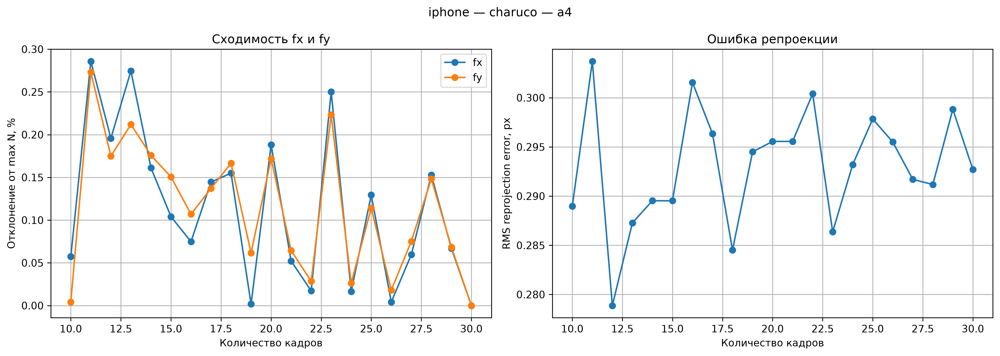

Вот картинка которая получилась в результате первого подхода. Что мы можем по ней сказать? "Все сложно и не понятно, но данные мы получили"

## Поэтому итоговая методика немного сложнее: 

Для каждого количества изображений

N = 10, 11, 12, ..., 30

из всех успешно распознанных кадров формируется до 31 различной случайной комбинации из N изображений. Для каждой комбинации независимо выполняется полная калибровка камеры и определяется RMS-ошибка репроекции.

Полученные 31 результата сортируются по RMS, после чего для дальнейшего анализа сохраняются три характерных случая:

- калибровка с минимальной RMS-ошибкой;
- калибровка с медианной RMS-ошибкой;
- калибровка с максимальной RMS-ошибкой.

Число 31 выбрано специально нечётным, чтобы медианному результату соответствовала одна конкретная калибровка, а не среднее между двумя соседними результатами.

Такой подход позволяет посмотреть уже не просто на то, как меняется результат при увеличении количества кадров, но и на его **устойчивость к выбору конкретных изображений**. Если увеличение N действительно делает калибровку надёжнее, можно ожидать, что разброс между результатами разных комбинаций будет уменьшаться.

Таким образом, в эксперименте я хочу ответить сразу на два вопроса:

1. **Сколько разнообразных кадров необходимо для устойчивого определения внутренних параметров камеры?**
2. **Зависит ли это количество от используемого калибровочного паттерна и способа его отображения — экран или печать?**

Вот и результаты первой такой калибровки, видно что медианная среднеквадратичная ошибка репроекции перестает сильно прыгать после где-то 15 кадров для калибровки, но интервал минмакс сокращается вплоть до 30 кадров.

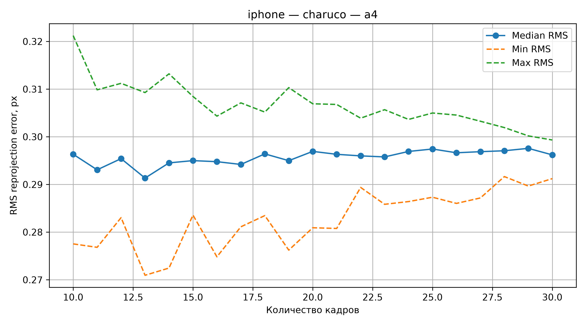

На данном этапе (а этот текст пишется в реальном времени, то есть я сама не знаю что будет дальше), можно сказать, что если у Вас есть возможность для CharUco паттерна берите максимум кадров (до 30, дальше мы не проверяли) и у вас будет достаточно хороший результат.

Теперь посмотрим на данные этого же паттерна, но где мишень была на планшете. 

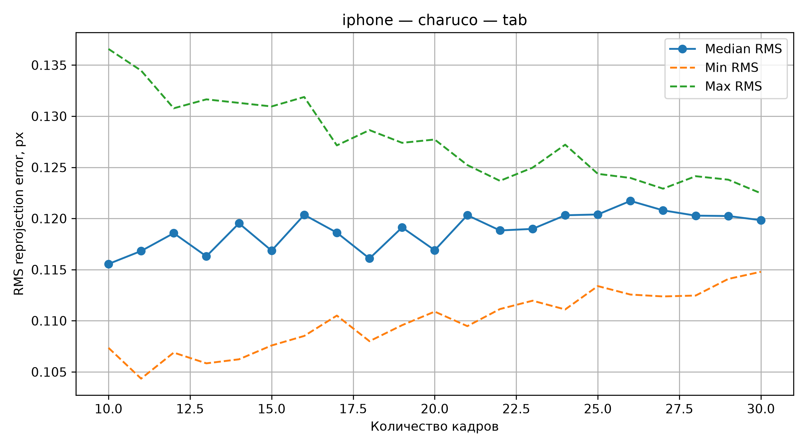

Тут мы видим что диапазон разброса RMS куда лучше (меньше) чем был на бумажной мишени. Пока это выглядит как рекомендация использовать экран, а не бумагу в качестве мишени.

Увеличение количества изображений с 10 до 30 практически не приводит к снижению медианной RMS-ошибки репроекции. При этом разброс RMS между различными комбинациями изображений уменьшается, что свидетельствует о снижении зависимости результата калибровки от выбора конкретной выборки. Однако при приближении размера выборки к общему количеству доступных кадров число возможных комбинаций уменьшается, поэтому сужение диапазона min–max в этой области не может рассматриваться как независимое доказательство повышения устойчивости.

Теперь давайте сравним другие паттерны калибровки подобным образом и перейдем к эмперическому сравнению резщультатов калибровки на различных паттернах.

## Все результаты c iphone

______________________________________________
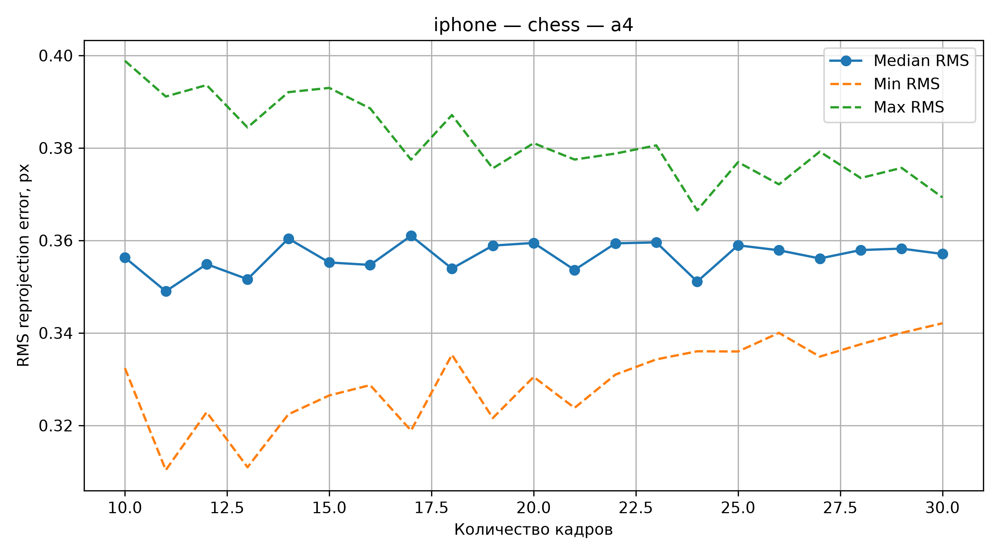
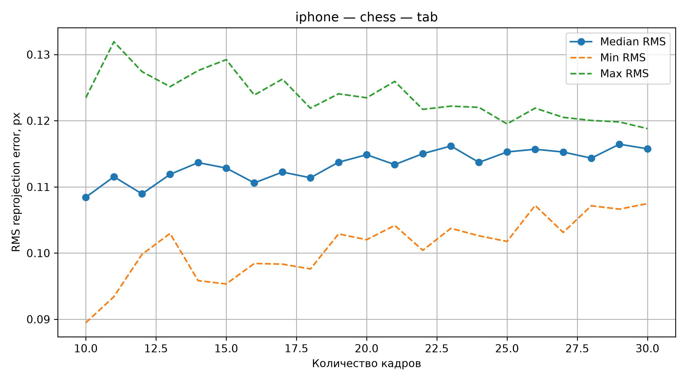
______________________________________________

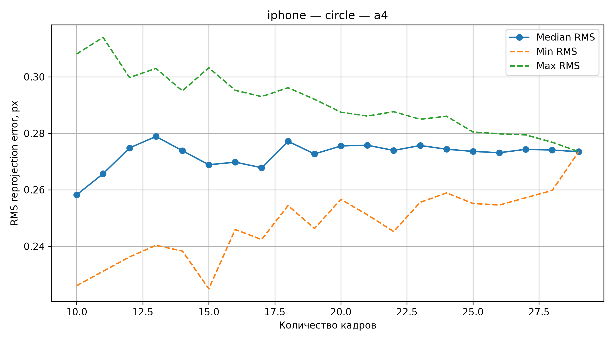
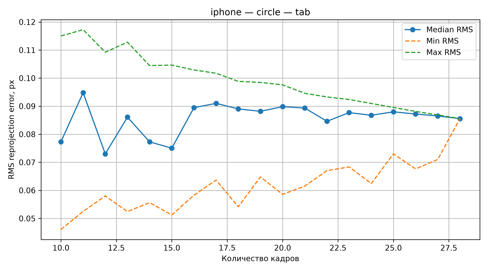
_____________________________________________

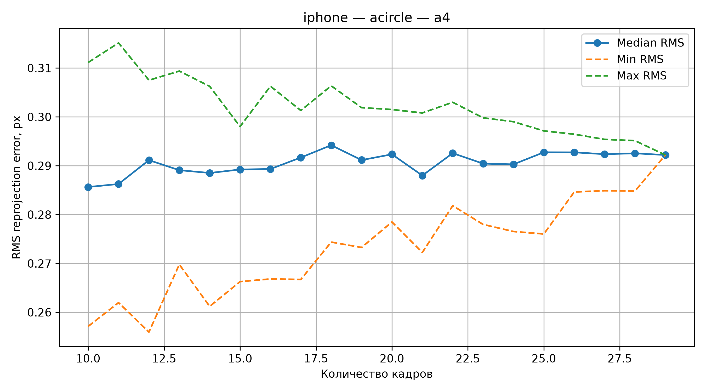
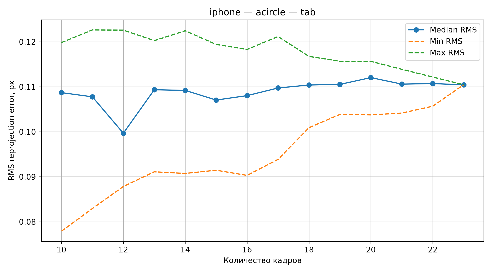

Для всех исследованных типов калибровочных мишеней отображение паттерна на планшете обеспечило существенно меньшую ошибку репроекции по сравнению с паттерном, напечатанным на бумаге A4.

Результаты эксперимента показывают, что увеличение числа калибровочных изображений не приводит к систематическому уменьшению RMS reprojection error. Медианное значение ошибки для большинства исследованных конфигураций остаётся приблизительно постоянным либо незначительно возрастает с увеличением числа кадров. При этом диапазон между минимальной и максимальной RMS ошибкой сокращается, что указывает на уменьшение чувствительности результата к выбору конкретного набора изображений. Следует учитывать, что при приближении числа используемых изображений к общему числу доступных кадров уменьшение разброса частично обусловлено сокращением числа возможных уникальных комбинаций.

Среди исследованных паттернов наименьшая RMS ошибка наблюдается для Symmetric Circles Grid как при использовании планшета, так и печатной мишени. Наибольшая ошибка для печатной мишени наблюдается у Chessboard. При этом для Circles Grid заметна выраженная асимметрия диапазона RMS относительно медианного значения, особенно при небольшом количестве изображений (Почему это так я не знаю, если Вы знаете (или узнаете) - напишите мне плз).

## Переход к новой контрольной мишени

### Исходная мишень

Первоначально для проверки результатов калибровки камеры использовалась готовая печатная мишень с тремя окружностями известного размера и известными расстояниями между их центрами.

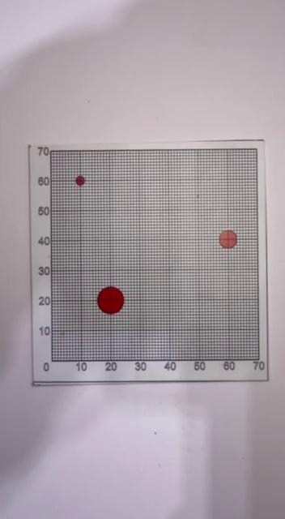

Предполагался следующий алгоритм:

кадр → коррекция дисторсии → определение плоскости мишени → гомография → вид сверху → определение центров окружностей → измерение расстояний в мм.

При обработке исходной мишени возникли проблемы:

- границы самой мишени определялись нестабильно;
- линии рамки и другие элементы изображения создавали лишние признаки;
- поиск плоскости через внешнюю рамку оказался избыточно сложным;
- возникла идея определять плоскость непосредственно по геометрическим маркерам мишени.

В результате было решено не усложнять алгоритм под существующую мишень, а изготовить собственную, специально предназначенную для обработки методами компьютерного зрения.

### 2. Разработка новой мишени

Новая мишень была создана в CorelDRAW под бумагу портативного принтера Xiaomi размером 50 × 76 мм (я тебя слепила из того, что было дома).

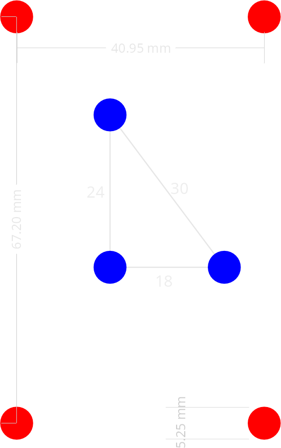

На ней размещены:
- 4 красных круга по углам — опорные точки для определения плоскости и вычисления гомографии;
- 3 синих круга — контрольные точки для последующих измерений;
- расстояния между центрами синих кругов заданы равными 18, 24 и 30 мм.

Таким образом, красные маркеры могут использоваться для восстановления плоскости мишени, а синие — как независимые контрольные точки, не участвующие в вычислении гомографии.

### 3. Проверка масштаба печати

Поскольку портативный фотопринтер и приложение Xiaomi могут автоматически масштабировать изображение, перед печатью рабочей мишени был создан отдельный калибровочный паттерн принтера.

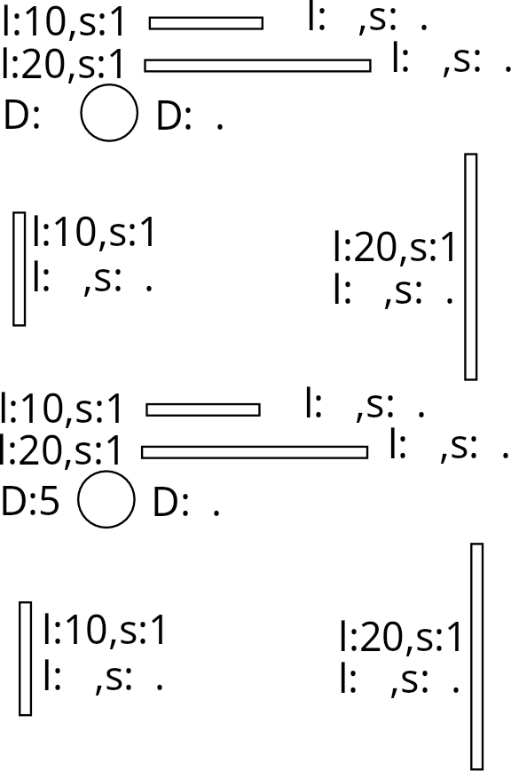

На нем в нескольких областях листа были размещены:

- горизонтальные эталоны длиной 10 и 20 мм;
- вертикальные эталоны длиной 10 и 20 мм;
- окружности известного диаметра.

После печати реальные размеры элементов были измерены штангенциркулем.

Для 20-миллиметровых элементов были получены значения около 18,55–18,70 мм.

Горизонтальные и вертикальные размеры оказались близкими, поэтому выраженного различия масштаба по осям X и Y обнаружено не было.

### 4. Определение коэффициента масштаба

По результатам измерений масштаб печати составляет приблизительно:

s ≈ 0,929

Таким образом, принтер воспроизводит линейные размеры примерно как 92,9 % от заданных.
Для компенсации масштабирования требуется увеличить исходный макет с коэффициентом:

k = 1 / s ≈ 1,077

Ориентировочный масштаб макета перед печатью составляет 107,7 %.

После изменения масштаба я выполнила повторную тестовую печать и измерила штангенциркулем прямоугольники и круги. Их значения были максимально близки к номинальным (с поправкой на мое косоглазие и кривость рук) и я счастливая двинулась дальше. Вообще, по хорошему, надо брать оборудование с заданной точностью печати и не париться, но у меня такого дома нет, а с домашним лазерным гравером я пока не подружилась.

## Результаты тестов на iphone

## Выводы по результатам проверки калибровки

Для калибровочных мишеней, напечатанных на бумаге формата A4, существенной и устойчивой зависимости ошибки измерения от типа используемого паттерна не наблюдается. Результаты для Chessboard, ChArUco, Symmetric Circles Grid и Asymmetric Circles Grid находятся в близком диапазоне, а кривые для разных паттернов многократно пересекаются. Вероятно, в данном случае влияние типа паттерна оказывается сопоставимым или меньшим по сравнению с другими источниками погрешности, связанными с физической мишенью и условиями съёмки.

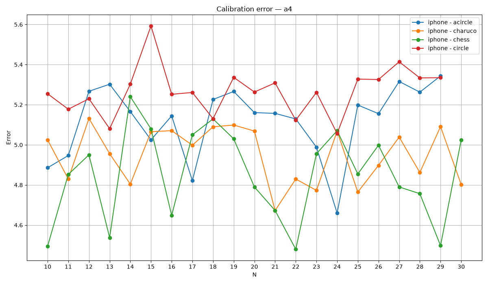

При отображении калибровочной мишени на экране планшета различия между паттернами становятся значительно более выраженными и сохраняются при изменении количества используемых кадров. Наименьшая ошибка наблюдается для ChArUco, далее следует Symmetric Circles Grid. Более высокую ошибку показывают Chessboard и Asymmetric Circles Grid. Таким образом, при использовании экрана планшета выбор типа калибровочного паттерна оказывает заметное влияние на метрическую точность полученной калибровки.

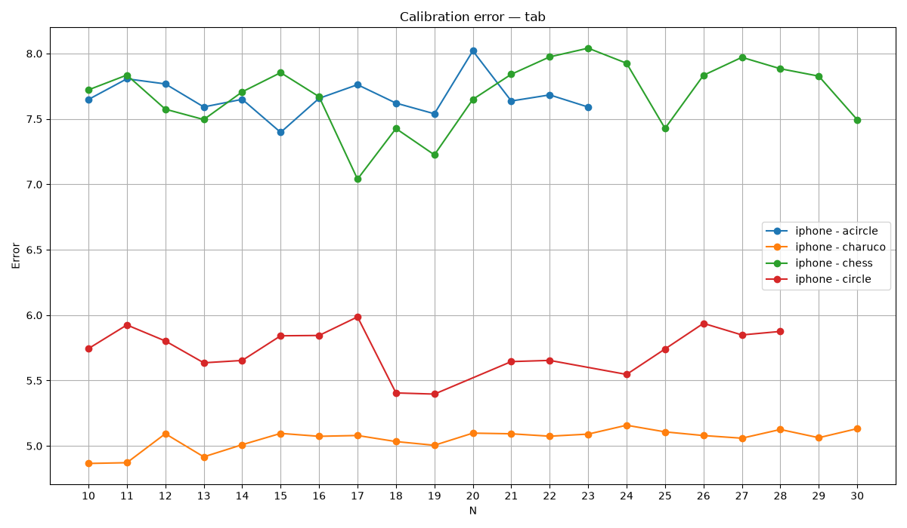

Увеличение количества калибровочных кадров от 10 до 30 не приводит к устойчивому уменьшению ошибки измерения. Для большинства паттернов значения колеблются около некоторого характерного уровня без выраженного нисходящего тренда. Это показывает, что после получения достаточного количества разнообразных положений калибровочной мишени дальнейшее увеличение числа кадров само по себе не гарантирует повышения точности.

Полученные результаты также показывают важность независимой метрической проверки калибровки. Низкая ошибка репроекции является характеристикой согласованности калибровочной модели с исходными точками, однако для практического применения камеры в измерительных задачах дополнительно необходимо оценивать точность восстановления известных геометрических размеров на независимой мишени.